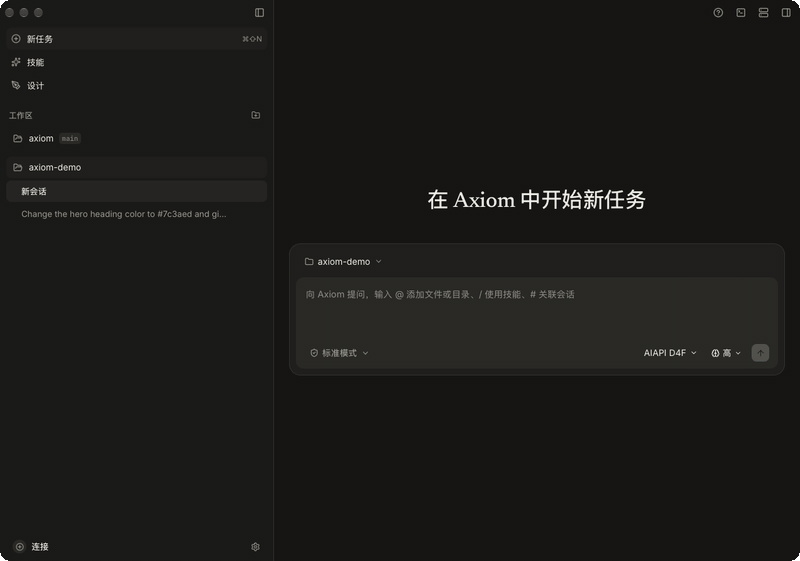

<h1 align="center">Axiom</h1>

<p align="center">
  <strong>本地优先的全栈工程 Agent</strong><br />
  <sub>设计 → 开发 → 部署，在同一受控边界内闭环</sub>
</p>

<p align="center">
  <a href="https://github.com/amuluze/axiom-agent/stargazers"></a>
  
  
  
  
  
</p>

<p align="center">
  <a href="README.md">English</a> · <strong>简体中文</strong>
</p>

<p align="center">
  
</p>

---

## 项目简介

**Axiom** 是一款本地优先的全栈工程 Agent，基于 Tauri 2、React 19、TypeScript 与 SQLite 构建。模型循环、工具协议、会话状态机与持久化边界全部自研——不依赖任何现成的 Agent Runtime，不上云同步：会话、审计链与 API Key 都留在本机（SQLite + 内容寻址存储，位于 `~/.axiom/`）。

设计（`.ax` 设计稿与画布）、开发（规范驱动工作流与 SubAgent 门禁）、部署（通过 SSH 快速部署服务到远程主机）共用同一套受控边界——工作区授权、逐次审批、可恢复事务——产物无需在工具间搬运。

> Axiom 当前处于 `0.6.1` 早期迭代阶段。

## 功能亮点

| 维度 | 你得到 |
|---|---|
| 自研运行时 | 流式模型循环、富消息协议、上下文压缩、重启恢复 |
| 内置工具 | read / write / batch patch / bash / ssh；deferred tools；结果 >256 KiB 自动外置到内容寻址存储 |
| 安全边界 | 显式工作区授权、逐次 diff 审批、seatbelt 沙箱默认开启、凭据脱敏、密钥不出 Rust 层 |
| 会话 | 分支树、重试即新分支、Checkpoint、SQLite 审计链 |
| 设计即代码 | 自研 `.ax` 格式 + 实时画布投影；`.ax` → TSX 骨架，像素级视觉对拍 |
| 远程部署 | 在 `~/.ssh/config` 别名或 Axiom 主机注册表内的主机上一次性执行命令，逐次审批 + 输出凭据脱敏 |

## 快速上手

下载安装（Developer ID 签名、已公证、支持自更新）：**[axiom.amuluze.com](https://axiom.amuluze.com)**

从源码构建（macOS 12+ / Node.js 22+ / Rust 1.96 via [rustup](https://rustup.rs)）：

```bash
git clone https://github.com/amuluze/axiom-agent.git
cd axiom-agent && npm install
npm run tauri -- dev   # 桌面开发模式（启用原生命令）
npm run dev            # 浏览器演示模式，无需 API Key
```

`npm run check` 是提交前完整门禁（typecheck + tests + build + Rust）。

## 参与贡献

**仅接受 Issue——不接受 Pull Request。** 实际开发在私有上游仓库进行；本仓库是公开分发与反馈渠道，每次发版从上游重新导出，所以 PR 无法合回，会被直接关闭不予审查。Bug 报告、功能请求与讨论欢迎以 Issue 形式提出。

如发现安全漏洞，请通过 [SECURITY.md](SECURITY.md) 私下报告——不要发公开 Issue。

## 许可证

[MIT](LICENSE) © 2026 amuluze。官网是安装包与更新的唯一公开渠道；本仓库是源码与产物归档。